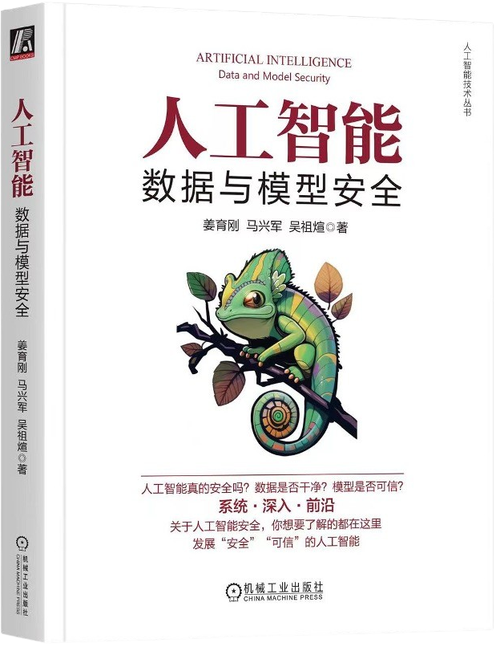

# 人工智能：：数据与模型安全

[第一版：ai-data-model-safety.github.io](https://ai-data-model-safety.github.io/)

<h5 align="center"><i>变色龙是丛林伪装大师，可以通过改变肤色来伪装和保护自己，代表着“变化”“适应”与“保护”，寓意安全防护的动态特性，需要适应复杂多变的外部环境。</i></h5>

本书是人工智能安全领域的入门教材，内容聚焦学术前沿，围绕人工智能的两大核心要素，即数据和模型，对相关的安全问题和攻防算法展开系统全面的介绍，使读者充分了解人工智能所面临的安全风险，学习并掌握基本的攻防理论和方法。

本书的特色包括：

- **深入**：详细讲解各类攻防算法及其背后的对抗和鲁棒优化思想
- **系统**：全面梳理介绍人工智能数据与模型面临的各类安全风险
- **前沿**：覆盖人工智能安全领域最前沿的攻防技术及其发展动态

本书适合人工智能、智能科学与技术、计算机科学与技术、软件工程、信息安全等专业的高年级本科生、研究生以及人工智能从业者阅读。通过本书，读者可以了解人工智能安全这一新兴领域，培养致力于发展“安全”“可信”人工智能的社会责任感。

## 课程内容

[课程主页](https://trust-ml.github.io/) | [课件](https://github.com/ai-data-model-safety/ai-data-model-safety.github.io/tree/dev/slides)

| 序号 | 主题                                                         | 简介                                                         |
| ---- | ------------------------------------------------------------ | ------------------------------------------------------------ |
| 1    | [课程介绍&机器学习基础](https://github.com/ai-data-model-safety/ai-data-model-safety.github.io/blob/dev/slides/第1周：课程介绍%26机器学习基础.pptx) | 机器学习的基本概念，包括典型的学习范式、损失函数、优化方法、模型、训练方法以及代表性的应用场景 |
| 2    | [可解释性和普通鲁棒性](https://github.com/ai-data-model-safety/ai-data-model-safety.github.io/blob/dev/slides/第2周：可解释性和普通鲁棒性.pptx) | 人工智能模型的可解释性主要思想及代表性方法，以及模型对常见扰动的鲁棒性 |
| 3    | [对抗样本](https://github.com/ai-data-model-safety/ai-data-model-safety.github.io/blob/dev/slides/第3周：对抗样本.pptx) | 现有的对抗样本生成攻击方法及对抗样本存在的代表性解释         |
| 4    | [对抗样本检测](https://github.com/ai-data-model-safety/ai-data-model-safety.github.io/blob/dev/slides/第4周：对抗样本检测.pptx) | 对抗样本检测方法的基本原理以及在实际应用中面临的挑战         |
| 5    | [对抗防御](https://github.com/ai-data-model-safety/ai-data-model-safety.github.io/blob/dev/slides/第5周：对抗防御.pptx) | 早期对抗样本防御方法及其不可靠性，对抗训练方法               |
| 6    | [数据投毒和防御](https://github.com/ai-data-model-safety/ai-data-model-safety.github.io/blob/dev/slides/第6周：数据投毒和防御.pptx) | 经典的数据中毒攻击方法及相关防御方法                         |
| 7    | [后门攻击和防御](https://github.com/ai-data-model-safety/ai-data-model-safety.github.io/blob/dev/slides/第7周：后门攻击和防御.pptx) | 后门攻击方法及其工作机制，机器学习模型的记忆特性             |
| 8    | [数据抽取和模型窃取](https://github.com/ai-data-model-safety/ai-data-model-safety.github.io/blob/dev/slides/第8周：数据抽取和模型窃取.pptx) | 深度学习模型记忆化引发的两种隐私问题                         |
| 9    | [隐私攻击和防御](https://github.com/ai-data-model-safety/ai-data-model-safety.github.io/blob/dev/slides/第9周：隐私攻击和防御.pptx) | 差分隐私的基本概念和经典方法，成员推断攻击及其防御方法       |
| 10   | [深度伪造与检测](https://github.com/ai-data-model-safety/ai-data-model-safety.github.io/blob/dev/slides/第10周：深度伪造与检测.pptx) | 传统的图像和视频篡改算法、深度伪造（Deepfakes）及其检测方法  |
| 11   | [联邦学习](https://github.com/ai-data-model-safety/ai-data-model-safety.github.io/blob/dev/slides/第11周：联邦学习.pptx) | 联邦学习的基本概念、隐私保护功能、收敛问题，以及联邦学习中的隐私攻击与中毒攻击及其防御方法 |
| 12   | [AI模型版权保护](https://github.com/ai-data-model-safety/ai-data-model-safety.github.io/blob/dev/slides/第12周：AI模型版权保护.pptx) | 经典的模型知识产权保护方法，包括模型水印、模型指纹和深度学习测试方法 |
| 13   | [AI公平性与伦理](https://github.com/ai-data-model-safety/ai-data-model-safety.github.io/blob/dev/slides/第13周：AI公平性与伦理.pptx) | 传统人工智能和联邦学习面临的典型公平性问题及解决方案，常见的偏见形式和无偏学习的原理 |

